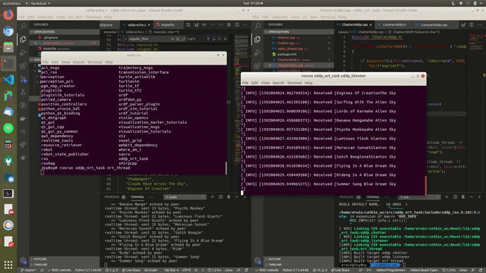
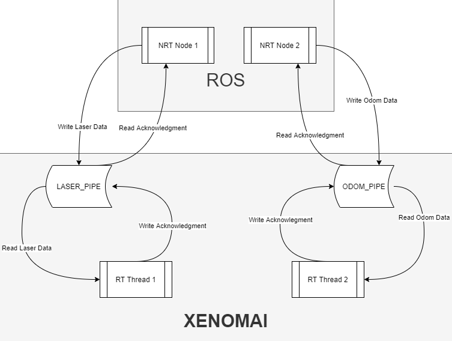

[![Contributors][contributors-shield]][contributors-url]
[![Forks][forks-shield]][forks-url]
[![Stargazers][stars-shield]][stars-url]
[![Issues][issues-shield]][issues-url]
[![MIT License][license-shield]][license-url]
[![LinkedIn][linkedin-shield]][linkedin-url]
[](http://hits.dwyl.com/mastererts/ros_xenomai_bridge)

<br />
<p align="center">
    <!--- relative path means image/image.png instead of https://etc... -->
                               
</a>

  <h3 align="center">Xenomai/ROS Bridge to bind NRT and RT applications</h3>

  <p align="center">
    Uses the XDDP communication protocol to create a pipe between Xenomai applications and ROS nodes
    <br />
    <a href="https://github.com/mastererts/ros_xenomai_bridge/readme.md"><strong>Explore the docs »</strong></a>
    <br />
    <br />
    <a href="https://github.com/mastererts/ros_xenomai_bridge">View Demo</a>
    ·
    <a href="https://github.com/mastererts/ros_xenomai_bridge/issues">Report Bug</a>
    ·
    <a href="https://github.com/mastererts/ros_xenomai_bridge/issues">Request Feature</a>
  </p>
</p>

## Table of Contents

* [About the Project](#about-the-project)
* [Setup](#setup)
* [Run](#run)
* [Roadmap](#roadmap)
* [Contribute](#contribute)
* [License](#license)
* [Contact](#contact)
* [Contributors](#contributors)

## About the Project

XDDP-based RT/NRT threads communication demo.

Real-time Xenomai threads and regular Linux threads may want to
exchange data in a way that does not require the former to leave
the real-time domain (i.e. secondary mode). Message pipes - as
implemented by the RTDM-based XDDP protocol - are provided for this
purpose.

On the Linux domain side, pseudo-device files named /dev/rtp<minor>
give regular POSIX threads access to non real-time communication
endpoints, via the standard character-based I/O interface. On the
Xenomai domain side, sockets may be bound to XDDP ports, which act
as proxies to send and receive data to/from the associated
pseudo-device files. Ports and pseudo-device minor numbers are
paired, meaning that e.g. port 7 will proxy the traffic for
/dev/rtp7. Therefore, port numbers may range from 0 to
CONFIG_XENO_OPT_PIPE_NRDEV - 1.

All data sent through a bound/connected XDDP socket via sendto(2) or
write(2) will be passed to the peer endpoint in the Linux domain,
and made available for reading via the standard read(2) system
call. Conversely, all data sent using write(2) through the non
real-time endpoint will be conveyed to the real-time socket
endpoint, and made available to the recvfrom(2) or read(2) system
calls.

Both threads can use the bi-directional data path to send and
receive datagrams in a FIFO manner, as illustrated by the simple
echoing process implemented by this program.

<p align="center">
    <!--- relative path means image/image.png instead of https://etc... -->
                               
</a>

See Makefile in the xeno_rt/ directory for more information

NOTE: XDDP is a replacement for the legacy RT_PIPE interface
available from the native skin until Xenomai 3.

On the ROS side, a node opens the pipe, reads the traffic, echoes it back and publishes on a defined topic. Another node subscribes and treats the data sent. An effective bridge indeed.

## Setup

Note : the project was tested with Xenomai 3, patched on a 4.19.117 kernel, and using ROS Melodic.

1. Install [Xenomai](https://mastererts.github.io/rtros-documentation/2020/04/21/xenomai.html)
2. Install [ROS](https://mastererts.github.io/rtros-documentation/2020/04/19/ros.html)
3. Clone the project in your `catkin_ws` : 
```shell
$ cd ~/catkin_ws/src
$ git clone https://github.com/mastererts/ros_xenomai_bridge.git
```
4. Build the project :
```shell
$ cd ~/catkin_ws
$ catkin_make
```

## Test

1. Launch the xenomai echo application :
```sh
$ cd ~/catkin_ws/src/ros_xenomai_bridge/talker
$ make
$ sudo ./start.sh
```

2. Run the ROS chatter node in a new terminal (read the pipe and publish the data)
```sh
$ rosrun xddp_talker chatter
```
Note : the xenomai application terminal should start echo-ing messages that were sent and echoed back by the ROS node

3. Run the ROS listener node in a new terminal (subscribe to /xddp and print the data)
```sh
$ rosrun xddp_talker listener
```
Note : everything went smoothly if it prints the same message echoed by the Xenomai Application terminal

If it ran with the expected behaviour, you can run the reactive navigation project! 

## Run

1. Launch the xenomai sensor application :
```sh
$ cd ~/catkin_ws/src/ros_xenomai_bridge/sensors
$ make
$ sudo ./start.sh
```

2. (New Terminal) Launch the Reactive Navigation package along with the ROS xddp_sensor node :
```sh
$ roslaunch xddp_bringup xddp_project_navigation.launch
```

The Xenomai application should have two real time threads printing respectively Odometry and Laser Scan data from the ROS application.

## Roadmap

See the [open issues](https://github.com/mastererts/ros_xenomai_bridge/issues) for a list of proposed features (and known issues).

## Contribute

Contributions are what make the open source community such an amazing place to learn, inspire, and create. Any contributions you make are **greatly appreciated**.

### Contribute on proposed features

1. Choose any open issue from [here](https://github.com/mastererts/ros_xenomai_bridge/issues). 
2. Comment on the issue: `Can I work on this?` and get assigned.
3. Make changes to your `Fork` and send a PR.

Otherwise just create the issue yourself, and we'll discuss and assign you to it if serves the project !

To create a PR:

Follow the given link to make a successful and valid PR: https://help.github.com/articles/creating-a-pull-request/

To send a PR, follow these rules carefully, **otherwise your PR will be closed**:

1. Make PR title in this formats: 
```
Fixes #IssueNo : Name of Issue
``` 
```
Feature #IssueNo : Name of Issue
```
```
Enhancement #IssueNo : Name of Issue
```

According to what type of issue you believe it is.

For any doubts related to the issues, i.e., to understand the issue better etc, comment down your queries on the respective issue.

## License

Distributed under the MIT License. See `LICENSE` for more information.

## Contact

Erwin Lejeune - [@spida_rwin](https://twitter.com/spida_rwin) - erwin.lejeune15@gmail.com

## Contributors

- [Erwin Lejeune](https://github.com/Guilyx)

[contributors-shield]: https://img.shields.io/github/contributors/mastererts/ros_xenomai_bridge.svg?style=flat-square
[contributors-url]: https://github.com/mastererts/ros_xenomai_bridge/graphs/contributors
[forks-shield]: https://img.shields.io/github/forks/mastererts/ros_xenomai_bridge.svg?style=flat-square
[forks-url]: https://github.com/mastererts/ros_xenomai_bridge/network/members
[stars-shield]: https://img.shields.io/github/stars/mastererts/ros_xenomai_bridge.svg?style=flat-square
[stars-url]: https://github.com/mastererts/ros_xenomai_bridge/stargazers
[issues-shield]: https://img.shields.io/github/issues/mastererts/ros_xenomai_bridge.svg?style=flat-square
[issues-url]: https://github.com/mastererts/ros_xenomai_bridge/issues
[license-shield]: https://img.shields.io/github/license/mastererts/ros_xenomai_bridge.svg?style=flat-square
[license-url]: https://github.com/mastererts/ros_xenomai_bridge/blob/master/LICENSE.md
[linkedin-shield]: https://img.shields.io/badge/-LinkedIn-black.svg?style=flat-square&logo=linkedin&colorB=555
[linkedin-url]: https://linkedin.com/in/erwinlejeune-lkn
